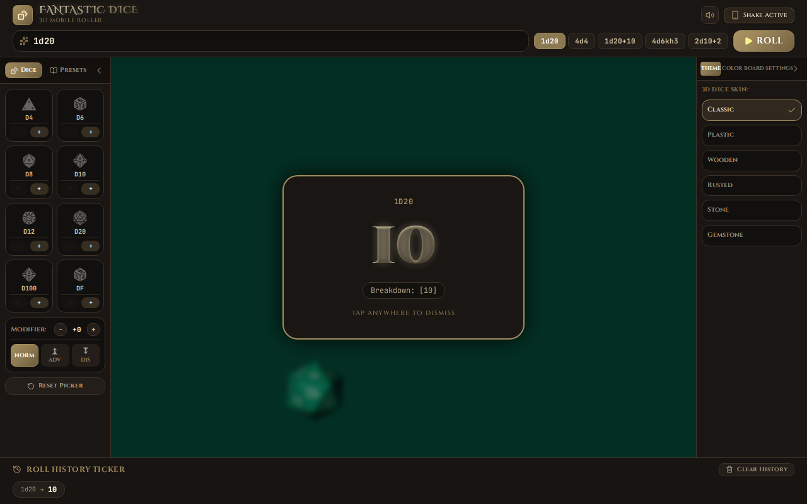

# 🎲 Fantastic 3D Dice Roller — Natural Tones Edition

A high-performance, mobile-first 3D physics dice rolling web & mobile application designed for tabletop RPG enthusiasts, Dungeon Masters, and players. Powered by **Three.js**, **Ammo.js WebAssembly physics**, **React**, and **Tailwind CSS**, Fantastic Dice Roller brings real polyhedral 3D dice physics directly to your browser and mobile device.



---

## ✨ Key Features

- 🎲 **Realistic 3D Physics Simulation**: Polyhedral dice (d4, d6, d8, d10, d12, d20, d100, and Fate/FUDGE `dF`) with realistic weight, collision physics, and angular momentum powered by Three.js and Ammo.js WebAssembly.
- 📜 **Full TTRPG Dice Notation Engine**: Supports complex notation including keep high (`kh`), keep low (`kl`), drop high/low (`dh`/`dl`), modifiers (e.g. `1d20+10`, `4d6kh3`, `8d6`), and exploding dice (`!`).
- 🎨 **High-Fantasy RPG Aesthetics**: Styled with Google Fonts (*Cinzel Decorative*, *Cinzel*, *EB Garamond*, *JetBrains Mono*), metallic gold gradients, dark parchment backgrounds, and glowing critical hit indicators.
- 🏆 **High-Fantasy Outcome Cards**: Auto-fading outcome badges displaying **CRITICAL HIT! (Natural 20)** gold sparkle banners, **CRITICAL FUMBLE! (Natural 1)** crimson thud banners, and detailed mathematical roll breakdowns.
- 📱 **Mobile & Tablet Optimized**: Responsive layout with collapsible side panels, compact navigation bars, and native Android support via Capacitor.
- 📱 **Shake-to-Roll Gesture Controls**: Hardware accelerometer integration that lets you shake your phone like a dice cup and place it flat on the table to roll.
- 🎨 **Interactive Color Wheel & Board Themes**: Choose from 3D dice skins (*Classic*, *Plastic*, *Wooden*, *Rusted*, *Stone*, *Gemstone*), custom conic-gradient color picker, and felt board surfaces (*Emerald*, *Sapphire*, *Crimson*, *Midnight*, *Leather*).
- 🔊 **Dynamic Audio & Haptics**: Built-in Web Audio API synthesizers and HTML5 audio for realistic dice impact sounds, victory chimes, and haptic vibration feedback.

---

## 🔗 Companion App Architecture & Inner Workings

Fantastic Dice Roller is designed as a standalone mobile application that serves as the **mobile companion app** for [**japiohopman/artificer**](https://github.com/japiohopman/artificer) — an advanced tabletop RPG campaign and character management tool.

### 🧠 How It Works (Inner Workings)

```text
┌─────────────────────────────────────────┐
│     japiohopman/artificer               │
│  (Desktop / Web TTRPG Companion Tool)   │
└──────────────────┬──────────────────────┘
                   │
                   │  1. Roll Request / Formula (e.g., "1d20+5")
                   ▼
┌─────────────────────────────────────────┐
│     Fantastic 3D Dice Roller            │
│  (Mobile Physics Dice Rolling Engine)   │
└──────────────────┬──────────────────────┘
                   │
                   │  2. WebGL 3D Physics Simulation (Ammo.js)
                   │  3. Physical Face Evaluation & Result Overlay
                   ▼
┌─────────────────────────────────────────┐
│     Aggregated Roll Outcome              │
│  (Total, Crits, Fumbles, Breakdown)     │
└─────────────────────────────────────────┘
```

1. **Independent Standalone Core**: Fantastic Dice Roller remains 100% self-contained without mandatory cloud or backend server dependencies. All physics simulations and notation parsing execute locally in WebGL.
2. **Data Exchange Structure**: Designed around standard TTRPG data structures:
   - **Roll Requests**: Formula notation strings (e.g. `2d20kh1+5`, `8d6`).
   - **Physical Mapping**: Physical 3D dice collision results map back onto parsed formulas via `updateParsedResultWithPhysicalRolls()` so the text overlay matches visual die faces accurately.
   - **Companion Integration Protocol**: Documented under [`docs/FUTURE_COMPANION_INTEGRATION.md`](docs/FUTURE_COMPANION_INTEGRATION.md) for lightweight asynchronous communication with [Artificer](https://github.com/japiohopman/artificer).

---

## 🛠️ Tech Stack

- **Frontend Framework**: React 19, TypeScript, Vite
- **Styling**: Tailwind CSS, Lucide React Icons, Custom CSS Glows
- **3D Physics & Graphics**: `@3d-dice/dice-box` (Three.js & Ammo.js WebAssembly)
- **Audio Synthesis**: Web Audio API & HTML5 Audio
- **Mobile Native Bridge**: Capacitor Core, Motion & Haptics (`@capacitor/android`)

---

## 🚀 Getting Started

### Prerequisites

- **Node.js** (v18 or higher recommended)
- **npm** or **bun**

### Installation

1. **Clone the repository**:
   ```bash
   git clone https://github.com/japiohopman/fancy-dice.git
   cd fancy-dice
   ```

2. **Install dependencies**:
   ```bash
   npm install
   ```

3. **Start the development server**:
   ```bash
   npm run dev
   ```
   Open `http://localhost:3000` in your browser.

4. **Build for production**:
   ```bash
   npm run build
   ```

---

## 📱 Mobile & Android Deployment

The project includes pre-configured Capacitor setup for Android builds.

```bash
# Sync web build to Capacitor Android
npm run cap:sync

# Build debug Android APK
npm run cap:build:apk
```

Output APK path: `android/app/build/outputs/apk/debug/app-debug.apk`

---

## 📚 Documentation

For deeper architectural details, check out the documentation in `docs/`:
- [`docs/ARCHITECTURE.md`](docs/ARCHITECTURE.md) — System architecture & design principles
- [`docs/FUTURE_COMPANION_INTEGRATION.md`](docs/FUTURE_COMPANION_INTEGRATION.md) — Mobile companion integration protocol with [Artificer](https://github.com/japiohopman/artificer)
- [`docs/ANDROID_ROADMAP.md`](docs/ANDROID_ROADMAP.md) — Android deployment guide

---

## 📄 License

MIT License — free for open-source and tabletop gaming use.
